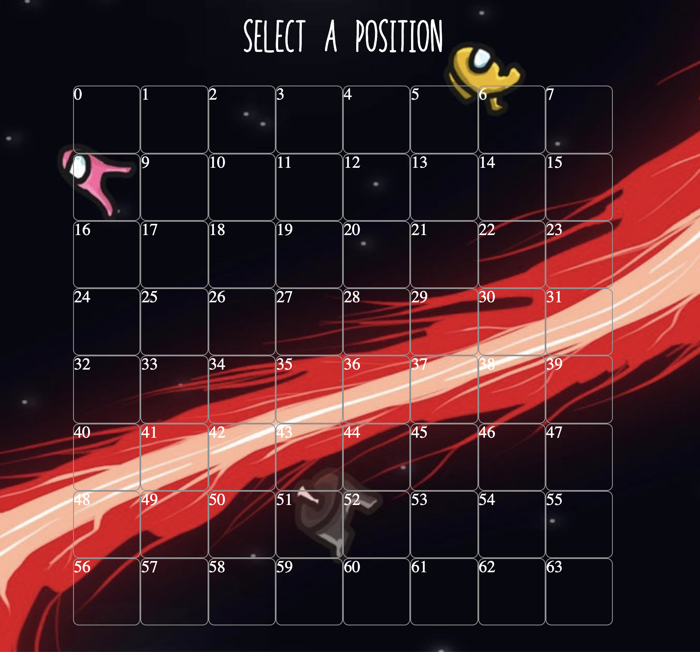
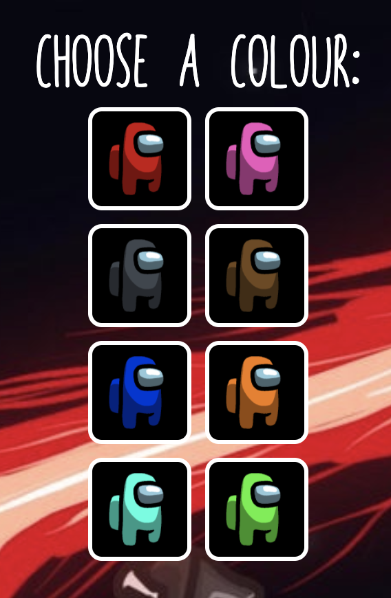

### General Assembly Software Engineering Immersive 
# Project 1 - Battleships      


## The Overview
This project is the first fully developed task - set as part of the Software Engineering Immersive Course from General Assembly.  

The task was to choose from a set of grid based games that could utilise array based logic and moving parts.  

I took on the task of creating Battleships, one of the two 3/3 difficulty games set out by our instructor. 

You can play my game here: ***[Battleships](https://harrytodd.github.io/Battleships/)***

### What is Battleships?
Battleships is a grid-based game where you must seek and destroy your opponents ships before they destroy yours.

### The Brief

- Render a game in the browser
- Design logic for winning & losing
- Include separate HTML / CSS / JavaScript files
- Stick with K.I.S.S (Keep It Simple Stupid) and D.R.Y (Don't Repeat Yourself) principles
- Use Javascript for DOM manipulation
- Deploy your game online, where the rest of the world can access it
- Use best practices when developing in HTML (semantic tags etc.)

### Technologies Used

- HTML5 & CSS3
- JavaScript (ES6)
- Git & GitHub

## The Game
In order to develop this game I identified a few core pieces of logic that would  be important to making this game playable - 

1. To generate the player's and computer's grids and populate the computer's grid with ships.
  - Set a board size
  - Set the computer's ships without repeating sizes or overlapping
2. Use logic to define the game boundaries
  - Ensure that ships do not go over the edge
3. Make the computer smart
  - If the computer hits a ship, next turn check the surrounding cells
  - If the computer reaches the end of the ship but has not destroyed it, go back the opposite direction of the first hit cell


### The Grid

The game is played across two grids on which the computer places their ships and the player places their's. It was important to ensure that the grid had strict borders that could not be overlapped.

This block of code receives a variable of 'width' and uses it in conjunction with a for loop to make two arrays of cells, called allPlayerCells and playablePlayerCells. This also creates an outer ring of cells with the class 'void', this is to ensure no ships can leave the grid and enter a 'void cell'.

In order for easier debugging, I added the ID of each cell to the innerHTML of that cell so that I could easily see what cell what which.

```javascript 
function playerGridGen() {
  let currNum = 0
  for (let i = 0; i < width ** 2; i++) {
    const div = document.createElement('div')
    div.classList.add('cell')
    playerGrid.appendChild(div)

    if (
      (i < width) ||
      (i % width === 0) ||
      (i > (width ** 2) - width - 1) ||
      (i % width === width - 1)) {
      div.classList.add('void')
    } else {
      div.id = currNum.toString()
      currNum++
      playablePlayerCells.push(div)
      allPlayerCells.push(div)
      allPlayerCellsIDs.push(Number(div.id))
      playablePlayerCellsIDs.push(Number(div.id))
    }
    playerCells.push(div)
    div.innerHTML = (div.id).toString()
  }
}
```

Here you can see the player's grid with the numbered cells (these are not visible in the final game, just for debugging purposes): 




### Computer Placement Logic

Making the computer choose the positions of their ships threw up a few challenges, however I managed to overcome them all and got all four ships on the board.

The main trouble I had with this was getting them not to overlap with existing ships and making sure all four ships were placed. I was getting an error where if the computer chose a cell for a ship where it would overlap with another then it would not try again, it would move on to the next ship. I fixed this with the below code:

```javascript
for (let i = randomCellVirt; i <= num; i += playerWidth) {
	if (playableCompCells[i].classList.contains('occupied')) {
		clearSpace--
	} else {
		clearSpace++
	}
}

if (clearSpace !== this.length) {
	randomCellVirt = this.randomCell()
} else {
...
}
```
A for loop is given a random cell (in this case randomCellVirt as the computer has chosen that this will be a vertical ship), the loop then procedes to check the cells below to make sure there is enough room for the ship. If not, it is caught in the if statement and another random cell is chosen and checked.

### Computer's Turn Logic
This was by far the most challenging part of the project, getting the computer to be smart with it's moves.

Until the computer hits a ship, as a human would do, it chooses random cells across the board. Once a ship has been hit the computer has to be smart about it's next move and choose a cell next to the cell it has just hit. After it has hit another cell next to the first one then they must keep going in that direction until the ship is destroyed. If they reach the end of the ship and it has not been destroyed then they should go back the opposite direction of the first cell they hit to destroy the ship.

The code for this is fairly long so here is a key snippet :

```javascript
if (lastTurnCell === null || (lastTurn === 'miss' && firstHitCell === null)) {
	const randomNum = Math.floor(Math.random() * playablePlayerCells.length)
	nextTurnInd = randomNum
	const randomCell = playablePlayerCells[randomNum]
	nextTurnCell = randomCell
	checkNextCell()
} else if (lastTurn === 'hit' && firstHitCell === null) {
	firstHitCell = lastTurnCell
	firstHitCellID = Number(firstHitCell.innerHTML)
	nextToFirstHitCell()
```
The checkNextCell function checks the cell that the computer has chosen for any player ships, if they have hit a ship then on their next turn it hits the 'else if' statement and chooses a cell next to the first hit cell.

Either checkNextCell or a function called keepGoingThatDirection (this one is quite self explanitory) is used at the end of every computer turn, depending on the if the previous turn is a hit or a miss and if they are currently destroying a ship or hitting random cells.

## Additional Components
### Sound Effects and Visuals
I based my game's theme on the game Among Us, all of the sounds and characters are from the game. The characters were much harder to find than I first thought, I had to install photoshop and buy a base image of the ghost version of each character in order to get all of the colours I needed.



I wanted to make the game very easy flowing with a lot of sounds to keep you interested. I have played many games where the game didn't flow and the there was next to no sound, so I wanted to avoid this at all costs, so every time something in the game happens, there is a sound to go along with it. 

## In Conclusion
### Future Features

1. Integrate a scoreboard based on the amount of turns taken to win.
2. Add responsive features to screen sizes.
3. Add mobile functionality.

### Lessons

This project was a huge learning experience, having been my first ever unguided project there were a lot of challenges but also a lot of wins. Now looking back, this is still my favourite project I have done and I couldn't be more proud of myself.

I learned how to manage my time and to not get hung up on styling before the game is even functional. My first playable version looked like it was straight out of the 80s! But from that I could very easily turn it into what it is now as all of the functionality was there, I just had to plug in the styles.

Link --> [Battleships](https://harrytodd.github.io/Battleships/)